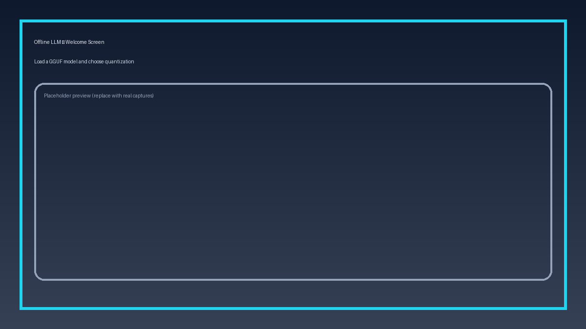
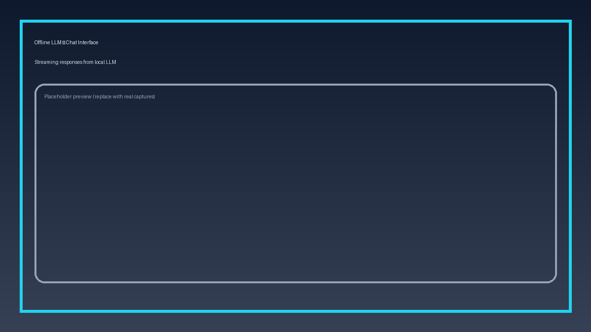

# Offline LLM

A cross-platform offline Large Language Model chat application that runs GGUF models locally on any device.


## Features

-  **100% Offline** - No internet connection required after installation
-  **Fast Inference** - Powered by llama.cpp for optimized performance
-  **Cross-Platform** - Works on Windows, macOS, Linux, and Android
-  **GGUF Support** - Load any GGUF format model
-  **Chat Interface** - Clean, intuitive chat UI with streaming responses
-  **Material Design 3** - Modern UI with light/dark mode support
-  **Privacy-Focused** - All processing happens locally on your device

## Screenshots

<p align="center">
  
  
</p>

## Installation

### Pre-built Binaries

Download the latest release for your platform from the [Releases](https://github.com/Aadhityan-A/offline-llm/releases) page.

| Platform | Download |
|----------|----------|
| Windows | [offline-llm-windows-x64.zip](https://github.com/Aadhityan-A/offline-llm/releases/download/v1.0/offline-llm-windows-x64.zip) |
| macOS | [offline-llm-macos.zip](https://github.com/Aadhityan-A/offline-llm/releases/download/v1.0/offline-llm-macos.zip) |
| Linux (tar) | [offline-llm-linux-x64.tar.gz](https://github.com/Aadhityan-A/offline-llm/releases/download/v1.0/offline-llm-linux-x64.tar.gz) |
| Linux (DEB) | [offline-llm_1.0_amd64.deb](https://github.com/Aadhityan-A/offline-llm/releases/download/v1.0/offline-llm_1.0_amd64.deb) |
| Linux (RPM) | [offline-llm-1.0.x86_64.rpm](https://github.com/Aadhityan-A/offline-llm/releases/download/v1.0/offline-llm-1.0.x86_64.rpm) |
| Android | [offline-llm-android.apk](https://github.com/Aadhityan-A/offline-llm/releases/download/v1.0/offline-llm-android.apk) |

### Building from Source

#### Prerequisites

- [Flutter SDK](https://flutter.dev/docs/get-started/install) (3.0+)
- [CMake](https://cmake.org/) (3.16+)
- Platform-specific build tools:
  - **Linux**: `sudo apt install cmake ninja-build clang libgtk-3-dev`
  - **Windows**: Visual Studio 2022 with C++ Desktop Development
  - **macOS**: Xcode Command Line Tools
  - **Android**: Android Studio with NDK

#### Build Steps

1. **Clone the repository**
   ```bash
   git clone https://github.com/Aadhityan-A/offline-llm.git
   cd offline-llm
   ```

2. **Build llama.cpp**
   ```bash
   git clone --depth 1 https://github.com/ggerganov/llama.cpp.git llama_cpp_build
   cd llama_cpp_build
   cmake -B build -DLLAMA_CURL=OFF
   cmake --build build --config Release -j$(nproc) -- llama-cli
   cd ..
   
   # Copy binaries
   mkdir -p bin
   cp llama_cpp_build/build/bin/llama-cli bin/
   cp llama_cpp_build/build/bin/*.so bin/ 2>/dev/null || true
   cp llama_cpp_build/build/bin/*.dylib bin/ 2>/dev/null || true
   ```

3. **Build for your platform**

   **Linux:**
   ```bash
   flutter build linux --release
   cp bin/* build/linux/x64/release/bundle/lib/
   ```

   **Windows:**
   ```bash
   flutter build windows --release
   copy bin\* build\windows\x64\runner\Release\
   ```

   **macOS:**
   ```bash
   flutter build macos --release
   cp bin/* build/macos/Build/Products/Release/offline_llm.app/Contents/Resources/
   ```

   **Android:**
   ```bash
   # Build llama.cpp for Android NDK first (see android/README.md)
   flutter build apk --release
   ```

## Usage

1. **Launch the application**
2. **Click "Load a GGUF Model"** to select a model file
3. **Start chatting!** Type your message and press Enter or click Send

### Recommended Models

Download GGUF models from [Hugging Face](https://huggingface.co/models?library=gguf&sort=downloads):

| Model | Size | Description |
|-------|------|-------------|
| [Llama 3.2 1B](https://huggingface.co/bartowski/Llama-3.2-1B-Instruct-GGUF) | ~700MB | Fast, lightweight |
| [Llama 3.2 3B](https://huggingface.co/bartowski/Llama-3.2-3B-Instruct-GGUF) | ~2GB | Balanced |
| [Phi-3 Mini](https://huggingface.co/microsoft/Phi-3-mini-4k-instruct-gguf) | ~2GB | Microsoft's small model |
| [Qwen2.5 3B](https://huggingface.co/Qwen/Qwen2.5-3B-Instruct-GGUF) | ~2GB | Multilingual |

**Note:** Choose Q4_K_M or Q5_K_M quantized versions for best balance of quality and speed.

## Architecture

```
offline-llm/
├── lib/
│   ├── main.dart              # App entry point
│   ├── models/                # Data models
│   ├── providers/             # State management
│   ├── screens/               # UI screens
│   ├── services/              # LLM service layer
│   └── widgets/               # Reusable widgets
├── bin/                       # llama.cpp binaries
├── android/                   # Android-specific code
├── linux/                     # Linux-specific code
├── macos/                     # macOS-specific code
├── windows/                   # Windows-specific code
└── .github/workflows/         # CI/CD pipelines
```

## How It Works

1. **Flutter UI** provides a cross-platform chat interface
2. **llama.cpp** handles model loading and inference
3. **Dart Process API** spawns llama-cli for generation
4. **Streaming** displays tokens as they're generated

## Contributing

Contributions are welcome! Please feel free to submit a Pull Request.

1. Fork the repository
2. Create your feature branch (`git checkout -b feature/amazing-feature`)
3. Commit your changes (`git commit -m 'Add some amazing feature'`)
4. Push to the branch (`git push origin feature/amazing-feature`)
5. Open a Pull Request

## License

This project is licensed under the CeCILL Free Software License Agreement (Version 2.1) - see the [LICENSE](LICENSE) file for details. The full agreement is available at [http://www.cecill.info/licences/Licence_CeCILL_V2.1-en.html](http://www.cecill.info/licences/Licence_CeCILL_V2.1-en.html).

## Acknowledgments

- [llama.cpp](https://github.com/ggerganov/llama.cpp) - GGUF inference engine
- [Flutter](https://flutter.dev/) - Cross-platform UI framework
- [Hugging Face](https://huggingface.co/) - Model hosting
